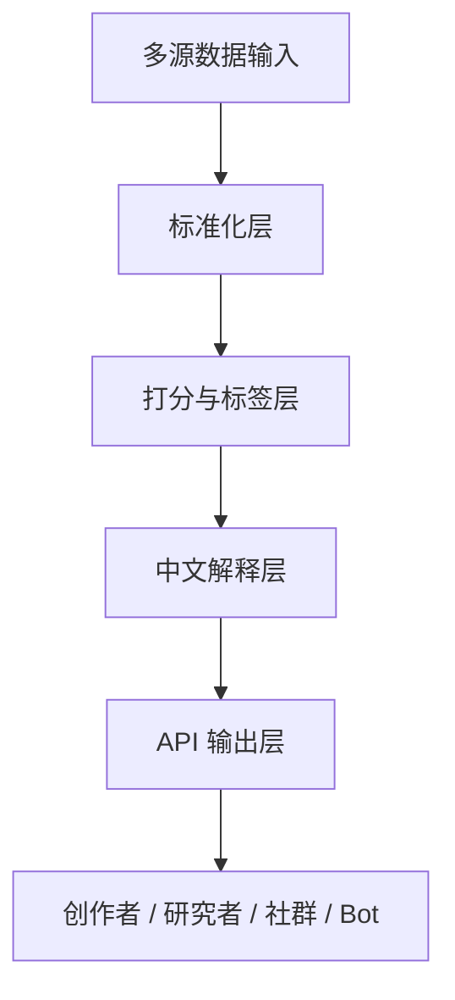
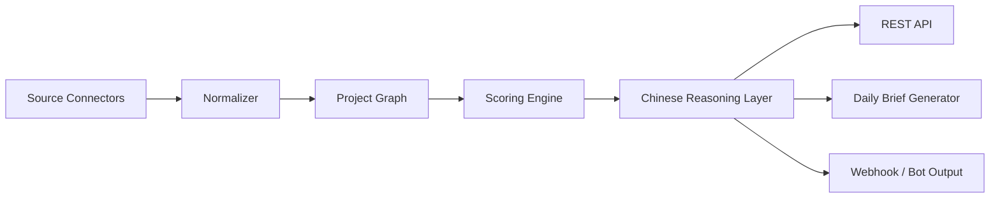

## 1. 产品定位

`中文 Web3 机会雷达 API` 不是一个“数据站镜像 API”，而是一个面向中文创作者、研究者、社群运营者与超级个体的“信号层 API”。

核心原则：

- 不直接卖原始站点数据
- 不强调单一来源
- 强调多源聚合、中文解释、优先级排序、行动建议
- 输出的是“今天该看什么、为什么值得看、接下来该做什么”

一句话定位：

> 一个面向中文 Web3 用户的多源信号聚合 API，把融资、空投、Upcoming、热点与项目链接翻译成可执行的中文机会雷达。

---

## 2. 目标用户

### 2.1 核心用户

| 用户类型 | 需求 | 愿意付费的原因 |
|------|------|------|
| Web3 内容创作者 | 需要稳定选题源、日更摘要、视频钩子 | 节省找题时间，提升内容频率 |
| 研究型用户 | 需要融资/项目/叙事跟踪 | 需要统一观察入口与优先级 |
| 社群/会员运营者 | 需要每日更新材料和观察名单 | 需要低成本稳定输出 |
| 超级个体/自动化玩家 | 需要接 API 做 bot、workflow、skills | 需要结构化、高频、可编排信号 |

### 2.2 非目标用户

- 高频量化交易者
- 做撮合、做下单、做盘口深度的交易产品
- 需要毫秒级行情或深度市场数据的机构

---

## 3. 产品边界

### 3.1 卖什么

- 中文融资雷达 API
- 空投优先级 API
- Upcoming 机会评分 API
- 每日内容摘要 API
- 项目链接聚合 + 打分 + 标签 API

### 3.2 不卖什么

- 原始行情镜像
- 全量站点数据转售
- 未加工的抓取表格
- 单纯“某网站私有 API”

### 3.3 价值主张

从用户角度，产品提供的是 4 个价值：

1. 筛选：从很多项目中筛出值得先看的少数
2. 排序：告诉用户今天优先看哪 3 个
3. 翻译：把英文/数据结构翻成中文判断
4. 行动：给出下一步动作，而不是停留在展示

---

## 4. 产品结构



### 4.1 数据输入层

来源可以包括但不限于：

- 项目聚合站
- 项目官网
- X / Discord / Docs
- Public Sales / Upcoming 信息
- 融资与基金信息
- 空投与活动信息
- 自建标签与人工审校

### 4.2 标准化层

负责：

- 项目去重
- 链接去重
- 名称统一
- 状态统一
- 时间格式统一
- 标签统一

### 4.3 打分层

负责：

- 融资强度分
- 空投执行分
- Upcoming 关注分
- 内容价值分
- 综合优先级

### 4.4 输出层

可输出到：

- REST API
- Telegram Bot
- Discord Bot
- 每日邮件 / TG 摘要
- 创作者工作流
- 内部 Dashboard

---

## 5. API 套件设计

### 5.1 `GET /v1/funding-radar`

用途：

- 返回最近值得关注的融资项目
- 输出中文判断和继续跟踪建议

示例响应：

```json
{
  "updated_at": "2026-06-03T09:00:00Z",
  "items": [
    {
      "project": "Example Project",
      "symbol": "EXP",
      "score": 84,
      "priority": "high",
      "stage": "Seed",
      "raise": "$2.00M",
      "date_label": "1天前",
      "funds": ["Fund A", "Fund B"],
      "reason_cn": [
        "融资阶段偏早，适合新机会跟踪",
        "出现高质量机构背书",
        "适合做研究与内容延展"
      ],
      "actions": [
        "查看官网与 X",
        "加入融资观察名单",
        "补充项目基本面"
      ],
      "tags": ["融资", "早期项目", "内容选题"],
      "links": {
        "profile": "https://...",
        "website": "https://...",
        "x": "https://..."
      }
    }
  ]
}
```

推荐查询参数：

- `limit`
- `min_score`
- `priority`
- `stage`
- `tag`

---

### 5.2 `GET /v1/airdrop-priority`

用途：

- 返回空投/活动项目优先级
- 适合做“今天先做哪几个”

示例字段：

- `execution_score`
- `risk_level`
- `newbie_friendly`
- `activity_types`
- `status`
- `actions`
- `links.task`
- `links.claim`

适合回答的问题：

- 今天最值得执行的 3 个项目是什么？
- 哪些项目更适合普通人？
- 哪些需要额外验证风险？

---

### 5.3 `GET /v1/upcoming-score`

用途：

- 对 Upcoming/IDO/ICO/IEO 做关注度评分
- 强调叙事价值与时间窗口

示例字段：

- `attention_score`
- `story_score`
- `time_urgency_score`
- `launchpad_quality_score`
- `date_label`
- `sale_type`
- `launchpads`
- `reason_cn`

适合回答的问题：

- 接下来一周最值得看的项目是什么？
- 哪些项目适合做预判型内容？
- 哪些项目更适合加入会员观察名单？

---

### 5.4 `GET /v1/daily-brief`

用途：

- 把多类信号压缩成一份中文日报
- 直接适合发 X / TG / 会员区

示例字段：

- `headline`
- `market_snapshot`
- `top_funding`
- `top_upcoming`
- `top_airdrop`
- `creator_angles`
- `operator_notes`
- `publish_ready_copy`

这个接口最适合做：

- 内容创作者日更输入
- 社群晨报
- 会员日报
- 自动化 bot 输出

---

### 5.5 `GET /v1/project-intel/:slug`

用途：

- 返回单个项目的聚合情报页

示例字段：

- `identity`
- `summary_cn`
- `scores`
- `tags`
- `latest_signals`
- `tracking_status`
- `links.profile`
- `links.website`
- `links.x`
- `links.discord`
- `links.docs`

适合回答的问题：

- 这个项目值不值得继续跟踪？
- 我现在应该先点哪些链接？
- 它更适合做内容、做空投，还是只做观察？

---

## 6. 统一响应规范

推荐统一 envelope：

```json
{
  "request_id": "req_xxx",
  "updated_at": "2026-06-03T09:00:00Z",
  "version": "v1",
  "data": {},
  "meta": {
    "limit": 10,
    "cursor": null
  }
}
```

推荐约定：

- `updated_at`：当前结果的生成时间
- `version`：接口版本
- `data`：业务数据主体
- `meta`：分页、筛选、缓存命中、配额信息

错误响应：

```json
{
  "request_id": "req_xxx",
  "error": {
    "code": "UPSTREAM_UNAVAILABLE",
    "message": "上游信号暂时不可用，请稍后重试"
  }
}
```

---

## 7. 统一数据模型

### 7.1 Project

```json
{
  "slug": "example-project",
  "name": "Example Project",
  "symbol": "EXP",
  "category": "Infra",
  "status": "watch",
  "tags": ["融资", "Upcoming", "内容选题"]
}
```

### 7.2 Score

```json
{
  "funding_score": 82,
  "airdrop_score": 54,
  "upcoming_score": 76,
  "content_score": 88,
  "overall_score": 81,
  "priority": "high"
}
```

### 7.3 Link Set

```json
{
  "profile": "https://...",
  "website": "https://...",
  "x": "https://...",
  "discord": "https://...",
  "docs": "https://...",
  "task": "https://...",
  "claim": "https://..."
}
```

### 7.4 Chinese Explanation

```json
{
  "reason_cn": [
    "项目近期信号密集",
    "适合继续跟踪",
    "可延展为公开视频选题"
  ],
  "actions": [
    "查看官网",
    "查看 X",
    "加入观察名单"
  ],
  "risk_cn": [
    "信息仍需二次核验"
  ]
}
```

---

## 8. 评分系统设计

### 8.1 融资雷达分

建议组成：

- `stage_weight`：轮次早期程度
- `raise_weight`：融资额
- `fund_quality_weight`：机构质量
- `freshness_weight`：时间新鲜度
- `narrative_weight`：叙事价值

可解释输出：

- 为什么高分
- 为什么值得跟
- 适合谁跟

### 8.2 空投执行分

建议组成：

- `status_weight`
- `activity_complexity_weight`
- `newbie_friendly_weight`
- `backer_weight`
- `proof_availability_weight`

输出目标：

- 给普通人“今天先做哪 3 个”

### 8.3 Upcoming 关注分

建议组成：

- `date_urgency_weight`
- `launchpad_weight`
- `story_weight`
- `project_context_weight`

输出目标：

- 给创作者“接下来一周该讲什么”

### 8.4 内容价值分

建议组成：

- `chinese_explainability`
- `hook_strength`
- `membership_expandability`
- `workflow_reusability`

输出目标：

- 给创作者和运营者判断“值不值得做内容”

---

## 9. 中文输出策略

这是这个 API 的差异化重点。

必须保证：

- 默认中文
- 不是纯翻译
- 是中文语境下的“机会解释”

输出风格建议：

- 结论先行
- 语言压缩
- 避免百科式介绍
- 每条结果尽量回答：
  - 值不值得看
  - 为什么值得看
  - 该做什么

---

## 10. 商业模式

### 10.1 推荐收费结构

采用两层收费：

1. **订阅**
2. **x402 按次调用**

### 10.2 为什么用混合模式

因为这类产品有两种用户：

- 高频用户：适合月订阅
- 临时查询用户：适合按次付费

### 10.3 推荐套餐

| 套餐 | 适合谁 | 能力 |
|------|------|------|
| Free | 试用用户 | 少量 daily brief、低频调用 |
| Pro | 创作者 / 超级个体 | funding + airdrop + upcoming + brief |
| Research | 研究者 / 社群 | 更高频率、更多字段、project intel |
| Team | 团队 | 多 key、webhook、历史数据、优先支持 |

### 10.4 x402 适合卖什么

最适合：

- 单次项目情报查询
- 单次日报生成
- 单次高分机会筛选

不最适合：

- 高频轮询型接口

因此建议：

- 高频场景走订阅
- 查询场景走 x402

---

## 11. 合规与产品叙事边界

### 11.1 对外叙事

不要说：

- 这是某站的私有镜像 API

建议说：

- 这是中文 Web3 机会雷达 API
- 是多源聚合、中文翻译、优先级排序与行动建议系统

### 11.2 内部原则

- 避免直接对外售卖“原始抓取结果”
- 尽量输出二次加工结果
- 强化自有标签、打分、摘要、建议
- 保留替换单一来源的能力

### 11.3 风险最小化路径

- 多源输入，不依赖单一站点
- 尽量卖“分析层”
- 保留 BYOK 或可替换源接口
- 建立缓存与快照机制

---

## 12. 技术架构蓝图



### 12.1 建议模块

- `connectors/`
- `normalizers/`
- `scorers/`
- `enrichers/`
- `briefs/`
- `api/`
- `billing/`

### 12.2 MVP 是否需要数据库

初期建议有：

- 项目表
- 信号表
- 链接表
- 打分表
- brief 快照表

推荐用途：

- 做缓存
- 做历史查询
- 做 webhook 增量
- 做后续排行榜

---

## 13. MVP 路线图

### Phase 1

只做 3 个接口：

- `/v1/funding-radar`
- `/v1/airdrop-priority`
- `/v1/daily-brief`

目标：

- 快速验证“中文信号层”是否有人愿意付费

### Phase 2

增加：

- `/v1/upcoming-score`
- `/v1/project-intel/:slug`
- webhook
- watchlist

### Phase 3

增加：

- 历史趋势
- 自定义标签
- 团队协作
- bot / MCP / skill 深度集成

---

## 14. 最小可卖版本建议

如果只做一个最先拿出去卖的版本，推荐：

### `Daily Brief API + Funding Radar API`

原因：

- 最容易展示价值
- 最适合创作者与运营者
- 最容易体现“不是搬运，而是压缩判断”
- 最适合和 YouTube / TG / 会员区联动

---

## 15. 最终产品话术

推荐对外表达：

> 中文 Web3 机会雷达 API，帮你把分散的融资、空投、Upcoming 与项目链接，压缩成可执行的中文判断、评分与每日摘要。

推荐对内理解：

> 我们不是在卖底层数据，而是在卖筛选、排序、解释与行动建议。

---

## 16. 下一步拆解建议

后续若进入执行阶段，建议继续输出 4 份文档：

1. PRD：明确用户、接口、付费与页面需求
2. Technical Architecture：连接器、缓存、数据库、评分服务
3. API Schema：完整 OpenAPI/JSON Schema
4. Billing Plan：x402 与订阅的计费设计

这 4 份文档拆完后，就可以正式进入 MVP 实施。
