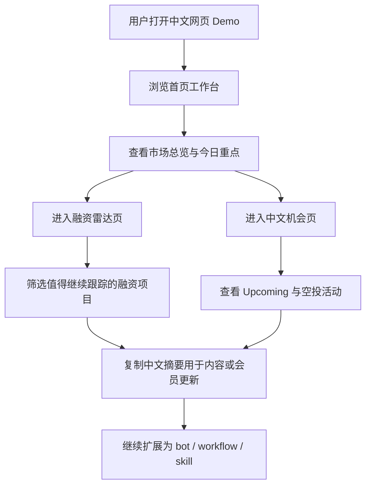

## 1. 产品概述
这是一个面向中文 Web3 用户的 `CryptoRank` 中文网页 Demo，把原本分散在网页和终端里的免费层数据入口，包装成一个适合演示、适合内容生产、适合后续自动化扩展的可视化工作台。

- 核心目标是把 `CryptoRank` 从“数据站”翻译成“中文机会雷达”，让用户在一个页面里快速看到市场、融资、Upcoming、空投活动和今日重点。
- 产品价值在于降低中文用户的信息压缩成本，同时为 YouTube 演示、会员区承接、bot 工作流和 skill 化封装提供统一前端入口。

## 2. 核心功能

### 2.1 用户角色
当前版本无需区分登录角色，默认作为公开演示工具使用。

| 角色 | 注册方式 | 核心权限 |
|------|----------|----------|
| 访客用户 | 无需注册 | 浏览中文雷达、查看数据卡片、切换模块、复制摘要内容 |

### 2.2 功能模块
1. **首页工作台**：品牌区、数据更新时间、中文总雷达、模块切换、核心数据卡片
2. **中文融资雷达页**：近期融资、阶段筛选、高信号项目卡片、机构线索
3. **中文机会页**：Upcoming IDO/ICO 与空投活动双栏展示、今日优先级推荐、中文摘要区

### 2.3 页面详情
| 页面名称 | 模块名称 | 功能描述 |
|-----------|-------------|---------------------|
| 首页工作台 | 顶部品牌区 | 展示中文标题、产品定位、刷新入口、时间戳、炫酷背景视觉 |
| 首页工作台 | 市场总览卡组 | 展示 BTC 占比、ETH 占比、总市值、24h 成交额等关键指标 |
| 首页工作台 | 模块导航 | 支持跳转到融资雷达、机会页、空投模块与每日摘要 |
| 首页工作台 | 头部币种与涨跌榜 | 以可视化列表展示热门币种、涨幅榜、跌幅榜 |
| 首页工作台 | 今日重点摘要 | 自动压缩“今天值得看的融资、Upcoming、活动” |
| 中文融资雷达页 | 融资列表 | 展示项目、阶段、融资额、机构、时间和信号判断 |
| 中文融资雷达页 | 信号解释区 | 用中文解释为什么值得看，突出阶段、机构、估值与热度 |
| 中文融资雷达页 | 复制卡片区 | 一键复制适合发 X / TG / 会员区的中文摘要 |
| 中文机会页 | Upcoming 列表 | 展示即将开始的 IDO/ICO/IEO、平台、时间、Moni 分数 |
| 中文机会页 | 空投活动列表 | 展示状态、活动类型、机构支持、最近更新时间 |
| 中文机会页 | 今日行动建议 | 自动生成“先看哪 3 个”的中文建议卡片 |

## 3. 核心流程
用户进入中文网页 Demo 后，先看到市场总览和今日重点，再按关注方向进入融资雷达或机会页查看详情，最后复制中文摘要去做内容、社群更新或继续接入自动化系统。

## 4. 用户界面设计
### 4.1 设计风格
- 主色调：深黑蓝 + 冷青绿荧光点缀 + 少量金属灰，强调“终端雷达 + 数据工作台”气质
- 按钮风格：圆角矩形、轻玻璃质感、边缘发光、悬停有微弱描边流光
- 字体与字号：中文标题使用更有性格的衬线或展示字体，正文使用清晰的中文无衬线字体，层级控制在 4-5 档
- 布局风格：桌面优先、多列工作台布局、卡片化信息区、局部打破网格的强调模块
- 图标风格：使用线性图标配合数字卡，避免 emoji，整体偏专业与未来感

### 4.2 页面设计概览
| 页面名称 | 模块名称 | UI 元素 |
|-----------|-------------|-------------|
| 首页工作台 | 顶部品牌区 | 大标题、副标题、渐变光晕、网格噪点背景、刷新按钮 |
| 首页工作台 | 市场总览卡组 | 四宫格数据卡、细描边、数字放大、高对比涨跌色 |
| 首页工作台 | 榜单区域 | 双列或三列卡片、简洁分隔线、悬停高亮 |
| 首页工作台 | 今日重点摘要 | 大卡片、中文要点列表、复制按钮、轻动画渐显 |
| 中文融资雷达页 | 融资信号区 | 表格式卡片、阶段标签、机构标签、优先级标记 |
| 中文机会页 | Upcoming 与空投双栏 | 左右双栏布局、状态徽章、行动建议侧边栏 |

### 4.3 响应式
- 采用桌面优先设计
- 平板下收缩为双列布局
- 手机端切换为单列滚动卡片布局
- 支持触屏点击、复制操作和粘性导航

### 4.4 3D 场景指导（如适用）
- 当前版本不做重 3D 场景，使用 2D 光晕、渐变网格、玻璃叠层和轻量动效营造氛围
- 背景可加入微弱扫描线、噪点纹理和浮动光斑，控制性能预算，避免影响页面加载
