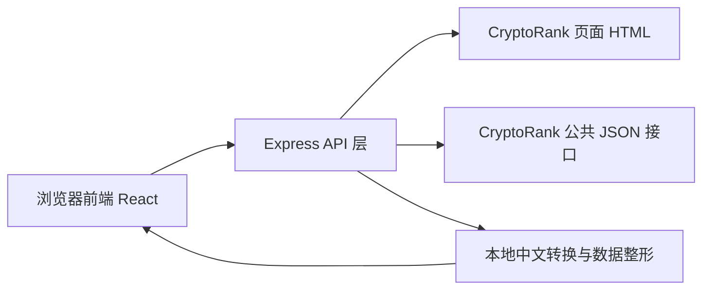
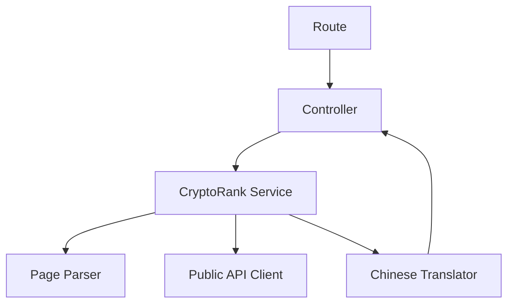
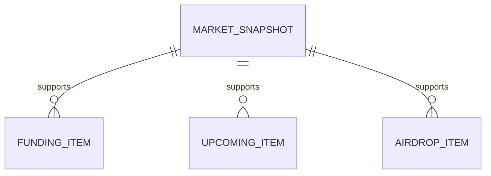

## 1. 架构设计
网页 Demo 采用前后端分离的轻量全栈结构：前端负责中文可视化展示与交互，后端负责代理 `CryptoRank` 免费层数据、解析 `__NEXT_DATA__` 以及统一输出给前端使用。



## 2. 技术说明
- 前端：React@18 + TypeScript + TailwindCSS@3 + React Router + Zustand
- 后端：Express + TypeScript
- 初始化方式：`vite-init` 模板 `react-express-ts`
- 数据来源：`CryptoRank` 官网页面 `__NEXT_DATA__` + 前台公共接口
- 运行模式：本地开发服务器，适合快速演示与录屏

## 3. 路由定义
| 路由 | 用途 |
|-------|---------|
| / | 中文首页工作台，展示市场总览、榜单、今日重点 |
| /funding | 中文融资雷达页，展示近期融资与高信号项目 |
| /opportunities | 中文机会页，展示 Upcoming 与空投活动 |

## 4. API 定义

### 4.1 接口清单
| 接口 | 方法 | 用途 |
|------|------|------|
| /api/radar | GET | 获取首页中文雷达数据 |
| /api/funding | GET | 获取中文融资雷达数据 |
| /api/upcoming | GET | 获取中文 Upcoming 数据 |
| /api/airdrops | GET | 获取中文空投活动数据 |
| /api/brief | GET | 获取中文每日摘要数据 |

### 4.2 TypeScript 类型定义
```ts
export interface MarketSnapshot {
  btcDominance: number
  btcDominanceChangePercent: number
  ethDominance: number
  ethDominanceChangePercent: number
  totalMarketCap: number
  totalMarketCapChangePercent: number
  totalVolume24h: number
  totalVolume24hChangePercent: number
}

export interface FundingItem {
  project: string
  stage: string
  raise: string
  funds: string[]
  dateLabel: string
  signal: string
}

export interface UpcomingItem {
  project: string
  saleType: string[]
  launchpads: string[]
  dateLabel: string
  raise: string
  moniScore: string
}

export interface AirdropItem {
  project: string
  rating: string
  activityTypes: string[]
  status: string
  updatedLabel: string
  funds: string[]
}

export interface BriefItem {
  title: string
  description: string
}
```

### 4.3 请求/响应约定
- 所有接口返回 JSON
- 返回结构统一包含：
  - `updatedAt`：后端抓取时间
  - `source`：数据来源说明
  - `data`：具体业务数据
- 当上游不可用时，接口返回明确错误信息与可展示的降级提示

## 5. 服务端架构图


## 6. 数据模型
### 6.1 数据模型定义
该 Demo 不引入数据库，数据为实时抓取并在服务端内存中短时缓存。



### 6.2 数据定义语言
当前版本无持久化数据库，无需 DDL。

## 7. 关键实现约束
- 前端全部使用中文文案，默认中文界面
- 后端统一处理免费层抓取与中文翻译，前端不直接请求 `cryptorank.io`
- 页面必须桌面优先，并保持录屏时的视觉冲击力
- 模块必须可复用，避免把数据处理逻辑散落在多个组件中
- 必须提供刷新入口、错误态、加载态和空状态

## 8. 测试与验证
- 前端：使用 `npm run check` 验证类型与构建
- 后端：使用接口请求验证 `/api/radar`、`/api/funding`、`/api/upcoming`、`/api/airdrops`、`/api/brief`
- 浏览器：打开页面验证中文界面、模块切换、数据加载与复制操作
